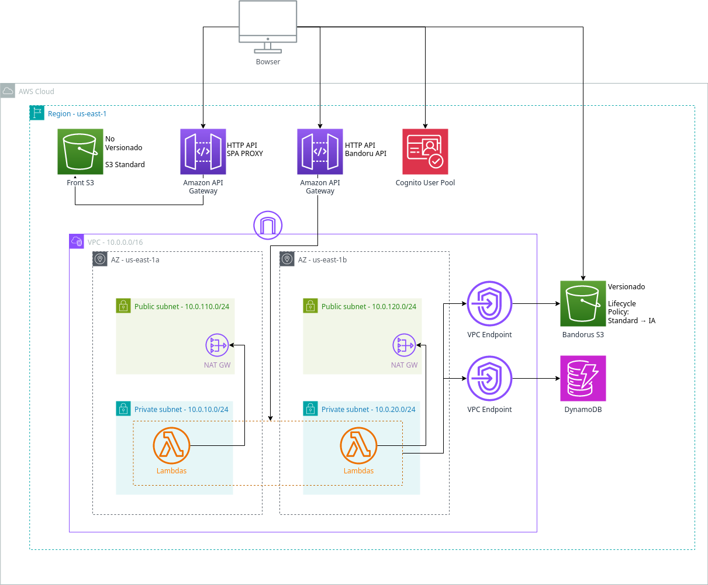

# Trabajo Práctico Cloud Computing - Entrega 3
## Grupo 9 - Integrantes
- Federico Shih
- Franco David Rupnik
- Agustín Morantes
- Matías Manzur
## Arquitectura

## How to deploy
### Prerequisitos
- docker

### Pasos
1. Colocar las credenciales de aws en `~/.aws/credentials`. Se usara el perfil `default`.
2. Asegurarse que el docker daemon se está ejecutando (`sudo systemctl start docker`)
3. Asegurarse que el usuario se encuentra en el grupo `docker`:
```shell
sudo groupadd docker
sudo usermod -aG docker $USER
newgrp docker
# Verificar que se puede ejecutar docker sin sudo:
docker run hello-world
# Si no se puede aún, reiniciar la pc para aplicar los cambios
```
4. Ejecutar el script de deploy `./docker-deploy.sh` -> Puede tardar varios minutos. :)
5. Esperar a que se ejecute el terraform y el deploy del frontend y el backend. Al final de todo, imprimirá la URL del sitio web.

Las variables de terraform están en `/frontend/terraform.tfvars`. Ahí se puede establecer cuál es el profile de aws a usar. Por defecto usa el 'default'.

**Nota:** Una vez sola nos pasó que se vencieron las credenciales de aws a la mitad del terraform apply y tiro un error que la account no tiene los permisos para hacer X modificación. Si esto sucede, apagar y prender el lab, volver a setear las credenciales y ejecutar de nuevo el script.

## Módulos utilizados
Los módulos externos que se usan en el código son los siguientes:
- ["terraform-aws-modules/dynamodb-table/aws"](https://registry.terraform.io/modules/terraform-aws-modules/dynamodb-table/aws/latest): Módulo para crear tablas de DynamoDB e indices.
- ["terraform-aws-modules/vpc/aws"](https://registry.terraform.io/modules/terraform-aws-modules/vpc/aws/latest): Módulo para crear VPCs y todo lo necesario dentor de las mismas.

Los módulos internos que se usan en el código son los siguientes:
- [lambda](lambda): Módulo para crear las lambdas para cada funcion que se implementa en el backend incluido los API Gateway y los permisos necesarios.

## Uso de funciones y meta-argumentos
Las funciones usadas en el código son las siguientes:
- [abspath](https://developer.hashicorp.com/terraform/language/functions/abspath): Devuelve la ruta absoluta de un archivo, lo usamos para obtener el path del root y con ello poder acceder al archivo de codigo placeholder de Lambdas.
- [zipmap](https://developer.hashicorp.com/terraform/language/functions/zipmap): Construye un mapa en base a dos listas ([keys],[values]), lo usamos para construir el mapa de variables de entorno de las Lambdas.
- [length](https://developer.hashicorp.com/terraform/language/functions/length): Devuelve la longitud de una lista, lo usamos para obtener la cantidad de elementos en el modulo de lambda y saber cuantas tenemos que crear.
- [join](https://developer.hashicorp.com/terraform/language/functions/join): Permite concatenar strings, lo usamos para armar el source_arn que se usa en el permiso de la lambda.

Los meta-argumentos usados en el código son los siguientes:
- [count](https://developer.hashicorp.com/terraform/language/meta-arguments/count): Permite crear múltiples recursos de un mismo tipo, lo usamos para crear múltiples lambdas que sólo cambian en el nombre.
- [for_each](https://developer.hashicorp.com/terraform/language/meta-arguments/for_each): Permite crear múltiples recursos de un mismo tipo, lo usamos para crear varios de los recursos necesarios.
- [depends_on](https://developer.hashicorp.com/terraform/language/meta-arguments/depends_on): Permite establecer dependencias entre recursos, lo usamos para explicitar varias de las dependencias que tienen los recursos que no pueden ser inferidas como en los buckets.

